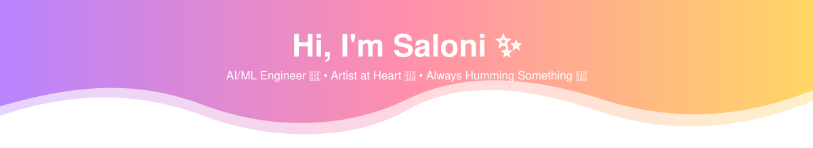

<div align="center">




<br/>


[](https://www.linkedin.com/in/saloni-sawant-6313a032a/)
[](mailto:saloniksawant@gmail.com)
[](https://github.com/Saloni060410)

</div>

---

## 🎨 About Me

I'm a Computer Engineering student who splits her attention between **training models** and **mixing colors** — somewhere between the two is where I do my best thinking. I build systems that pair machine learning with automation and computer vision, and I care less about shipping a feature than about whether it actually closes a real gap for the person using it.

When I'm not deep in a notebook or a codebase, I'm probably sketching something, arranging a playlist that makes no sense to anyone but me, or finding the overlap between the two — the same instinct for composition and rhythm shows up whether I'm designing a UI or a melody.

```txt
const saloni = {
  studying:     ["B.E. Computer Engineering", "B.S. Data Science & Applications @ IIT Madras"],
  building:     "AI agents, computer vision, and things that quietly save people time",
  currentWork:  "Enterprise AI Engineer Intern @ Neuranest Data Labs",
  currentFocus: "provider-agnostic LLM orchestration + ReAct-style agentic workflows",
  offline:      ["painting", "curating playlists", "community service"]
};
```

---

## 🌸 Currently

- 🎓 3rd-year **B.E. Computer Engineering** @ Thadomal Shahani Engineering College — *CGPA 9.29*
- 📊 Pursuing **B.S. in Data Science & Applications** @ IIT Madras (online)
- 🧑‍💻 **Enterprise AI Engineer Intern** @ Neuranest Data Labs — building a multi-tenant, cloud-native AI platform with a provider-agnostic LLM routing layer (Claude / OpenAI / Gemini / Ollama)
- 🤖 Exploring agentic tool-calling loops, RAG grounding, and reliable multi-model fallback

---

## 🧰 Tech Stack

<div align="center">

**Languages**
<br/>


**AI, Agents & Automation**
<br/>


**ML, Data Science & Computer Vision**
<br/>


**Web & Backend**
<br/>


**Data & Infrastructure**
<br/>


**Tools & Analytics**
<br/>


</div>

---

## 📊 GitHub Stats

<div align="center">


<br/>

</div>

---

<div align="center">

*"Some days it's a notebook, some days it's a sketchbook — same brain, different tools."*


</div>

